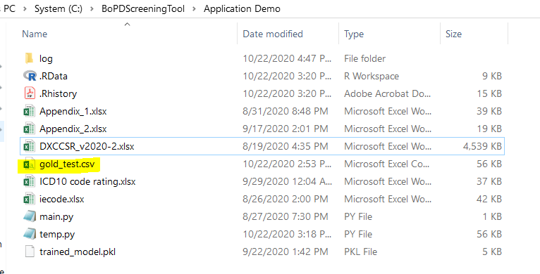
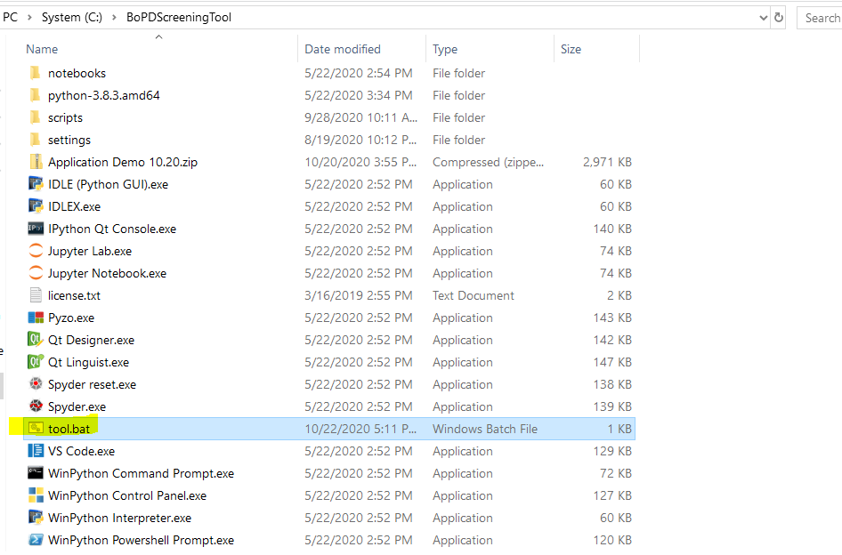
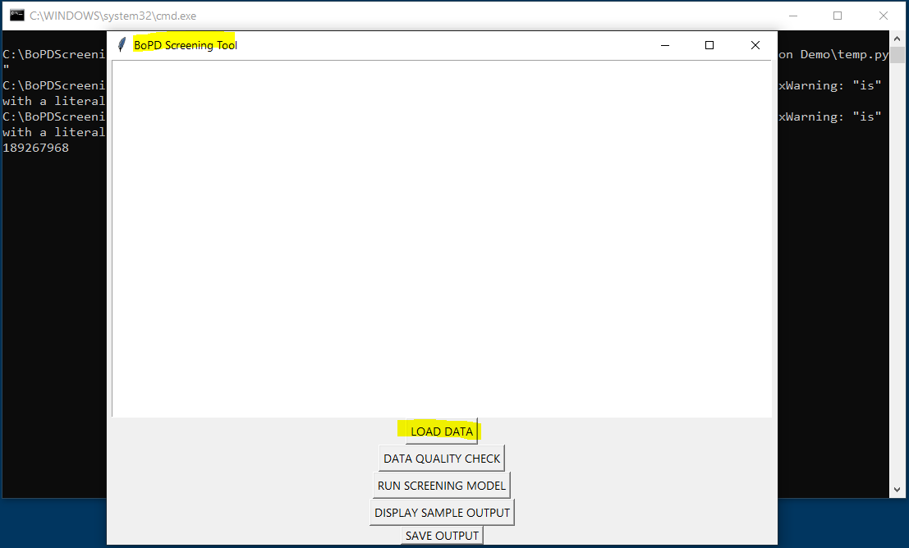
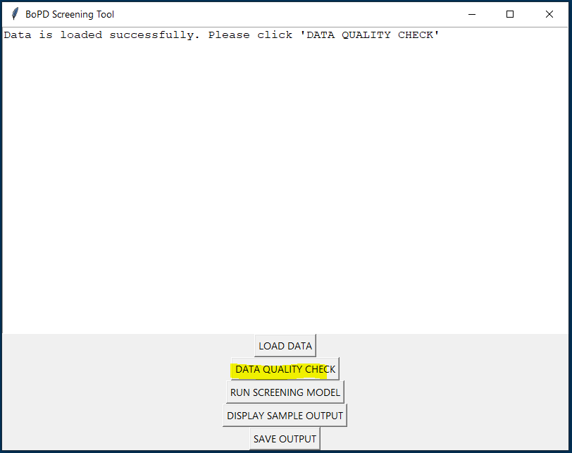
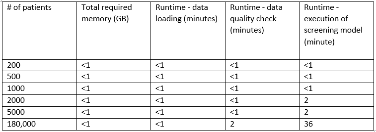
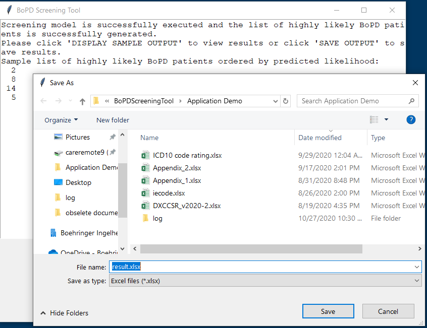
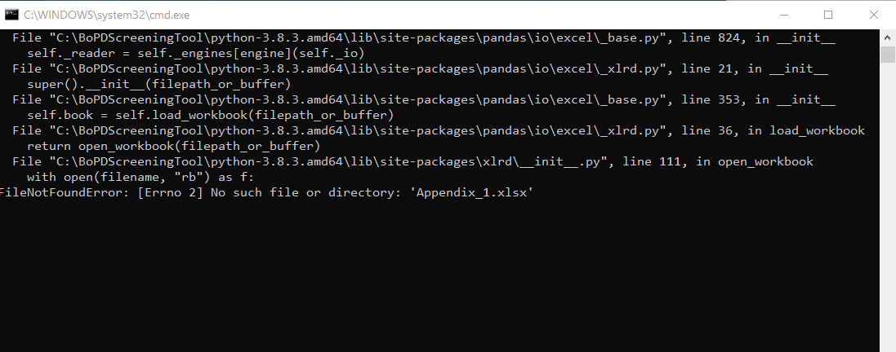

## Step-by-step implementation guide
 
 
**Step 0.** Save and unzip BoPDScreeningTool.zip file. 

**Step 1.** Place the input dataset prepared from the previous section under folder “BoPDScreeningTool/Application Demo”, and it should be saved as .csv file. 
Here are already preloaded files working as required built-in components for running the screening tool. The input sample dataset, gold_test.csv, is for testing purpose. 

 
**Step 2.** Open “tool.bat” (highlighted in yellow below).

***Note**: If regular python is used, please use Spyder to execute main.py script in the Application Demo folder.* 

**Step 3.** A black command prompt window (cmd.exe) will appear first and then a window called ‘tk’ will pop up after a few seconds. Click on ‘LOAD DATA’ button to load the dataset from Step 1. Again, this dataset should be in .csv format and it is placed under folder “BoPDScreeningTool/Application Demo”. 

**Step 4.**  After seeing following notice on the window, click ‘DATA QUALITY CHECK’ button.  

Note: If the dataset is not loaded successfully, a reminder will show up on the screen and the program will terminate if ‘DATA QUALITY CHECK’ button is clicked.

  
**Step 5.** Notice will appear on the window if data quality check is passed. Then please move on to click “RUN SCREENING MODEL”.  

If data quality check is not passed, there will be notice on the window. Please check the log file and make updates on the input dataset. The tool will terminate automatically if clicking on next model running button without passing the data quality check. Notice will appear on the window if model runs through successfully. If not, the tool will terminate automatically and please refer to log file (details in separate section) for error shooting. 

Run-time estimation (based on computer with Intel Core i5-8350U CPU and 8 GB memory):  
 

**Step 6.** Click display and save button to review and save the results as .xlsx file. The results includes patient_sk (patient identification number) for those predicted by the algorithm as highly likely BoPD patients. 
Note: please make sure to type “.xlsx” in the File name when saving the results. 
 
 
 
## Debugging
 
If the program stops working, it is highly likely that there is an unmet requirement in the input dataset or missing steps during implementation. Please refer to the self-generated log file under “log” folder to check details. 
For further help, please send the log file together with messages on the black command prompt window (cmd.exe) to zzMEDBDSBoPDscreeningsupport@boehringer-ingelheim.com
To save command window interface:
 
 

